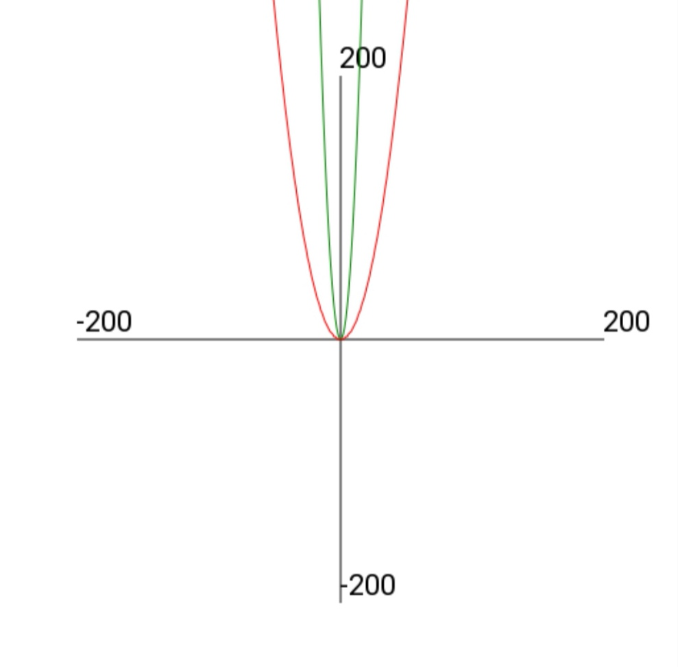
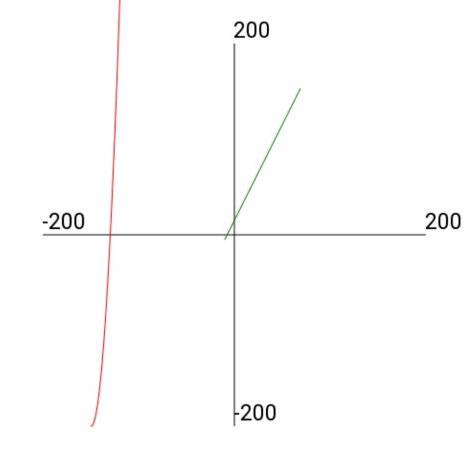

# **Модуль PyGraF**

Данный модуль для Python позволяет очень просто строить графики.
Информацию о каждом классе и функциях можно также узнать из IDE.
-----

## **Установка**
Скачайте файл `pygraf.py` из релиза и переместите в папку с проектом. 
Также может быть необходимо (при наличии ошибки tkinter) импортировать библиотеку `tkinter`. 

```
import turtle
from pygraf import *
```

------

## **Оформление**
1. Координатная плоскость<br>
Отрисовать координатную плоскость

>draw_coord( size:int - размер )

2. Настройка экрана<br>

>screen_conf(title:str - название окна,
height:int - высота,
width:int - ширина, anim:bool(v>=0.1.0) - включить анимацию отрисовки )


3. После построений<br>
_(v<0.1.0)_<br>
...Не закрывать окно.<br>
_(v>=0.1.0)_<br>
...Не закрывать окно и начать отслеживать перемещение.<br>
...Приближать и отдалять можно на клавиши (+) и (-)<br>
...Двигать на стрелочки

>screen_save()


-----
## _**y_plot** (y = ... x)_
(задаётся y, зависимый от x)
> y_plot( **equation**:str, - выражение,
mult:float|int - читайте ниже,
 x_from:int, - миним. значение x,
 x_to:int - макс. значение x )

Пример:
```
urav = y_plot("y = 2 * x + 15", 1, -10, 70)
urav.draw("red")
```
* Параметр **mult** (v>=0.0.2) домножает Y на указанное значение _(int, float)_
```python
urav = y_plot("y = x ** 2", mult = 1)
urav.draw("green")
urav_m = y_plot("y = x ** 2", mult = 0.1)
urav_m.draw("red")
```


> Функция draw(color:str - цвет ) может принимать такие значения, как "red", "yellow", "green", "blue" и так далее.

------

## **Пользовательские графики** 
#### ( _y_ равен каждому значению из списка)

> list_plot(data_array - список с данными _(int, float)_,
start_x - смещение по x _(int)_,
start_y - смещение по y _(int)_ )

>Пример кода с использованием библиотеки PyGraF:
```python
import turtle
from pygraf import *


screen_conf("Example", 500, 500)
draw_coord(200)

bidon = [0]
for i in range(101):
	k = bidon[ len(bidon) - 1 ] + i
	bidon.append( k )

cus = list_plot(bidon, -150, -200)
cus.draw("red")

urav = y_plot("y = 2 * x + 15", 1, -10, 70)
urav.draw("green")

screen_save()
```



