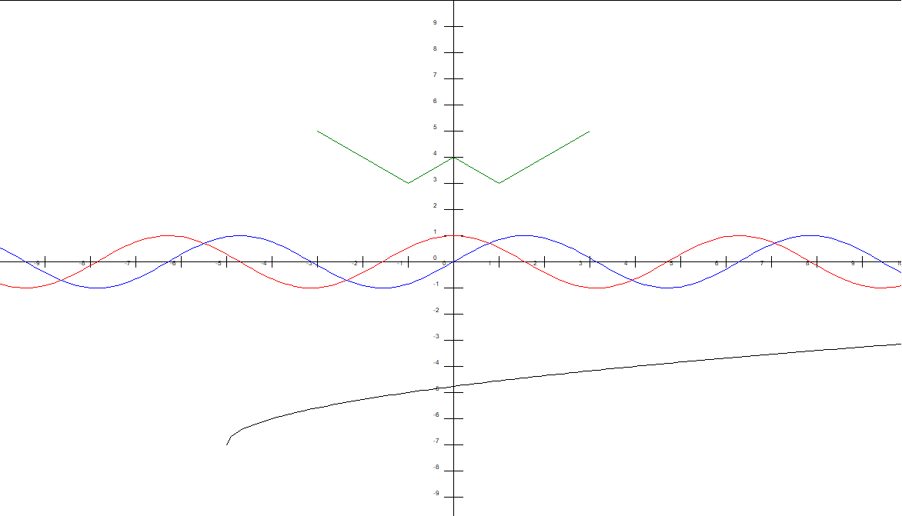

# **Модуль PyGraF**

Данный модуль для Python позволяет очень просто строить графики.
Информацию о каждом классе и функциях можно также узнать из IDE.

Пример `test.py`:



-----

## **Установка**
Скачайте файл `pygraf.py` из релиза и переместите в папку с проектом. 
Также может быть необходимо (при наличии ошибки tkinter) импортировать библиотеку `tkinter`. 

```python
import turtle
from pygraf import *
```

------

## **Оформление**
1. Координатная плоскость<br>
Отрисовать координатную плоскость с засечками

```
draw_coord( size:int - размер, sep_step, sep_size )
```

2. Настройка экрана<br>

```
screen_conf(title:str - название окна,
height:int - высота,
width:int - ширина, anim:bool - включить анимацию отрисовки)
```


3. После построений<br>
`v < 0.1.0`<br>
...Не закрывать окно.<br>
`v >= 0.1.0`<br>
...Не закрывать окно и начать отслеживать перемещение.<br>
...Приближать и отдалять можно на клавиши (+) и (-)<br>
...Двигать на стрелочки

```
screen_save()
```


-----
## _**y_plot** (y = ... x)_
(задаётся y, зависимый от x)

```
y_plot( equation:str - выражение,
 mult:float|int - читайте ниже,
 x_from:int - миним. значение x,
 x_to:int - макс. значение x )
```

Пример:
```python
urav = y_plot("y = 2 * x + 15", 1, -10, 70)
urav.draw("red")
```
* Параметр **mult** домножает Y на указанное значение _(int, float)_
```python
urav = y_plot("y = x ** 2", mult = 1)
urav.draw("green")
urav_m = y_plot("y = x ** 2", mult = 0.1)
urav_m.draw("red")
```


> Функция draw(color:str - цвет ) может принимать такие значения, как "red", "yellow", "green", "blue" и так далее.

------

## **Пользовательские графики** 
#### ( _y_ равен каждому значению из списка)

```
list_plot(data_array:list[int] - список с данными,
 start_x:int - смещение по x,
 start_y:int - смещение по y )
```

>Пример кода с использованием библиотеки PyGraF:
1.
```python
import turtle
from pygraf import *


screen_conf("Example", 500, 500)
draw_coord(200)

bidon = [0]
for i in range(101):
	k = bidon[ len(bidon) - 1 ] + i
	bidon.append( k )

cus = list_plot(bidon, -150, -200)
cus.draw("red")

urav = y_plot("y = 2 * x + 15", 1, -10, 70)
urav.draw("green")

screen_save()
```


2. Смотрите `test.py`
